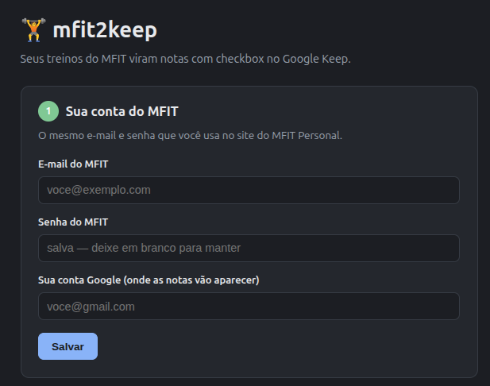
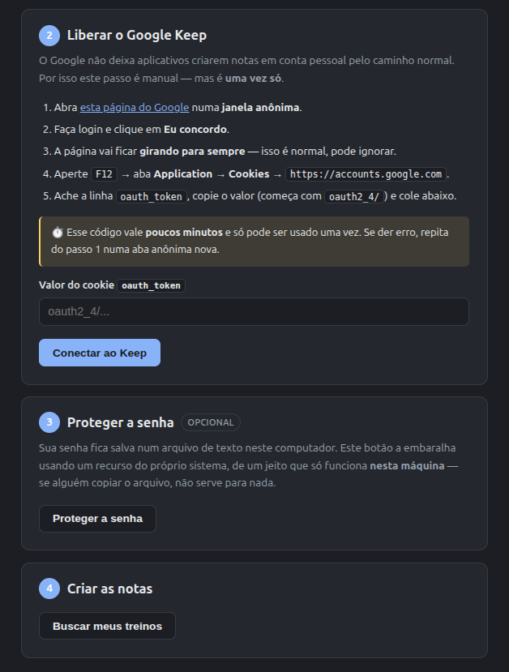
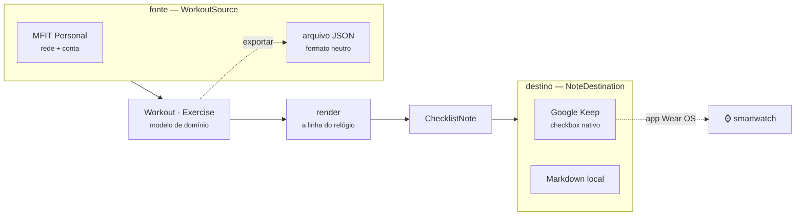
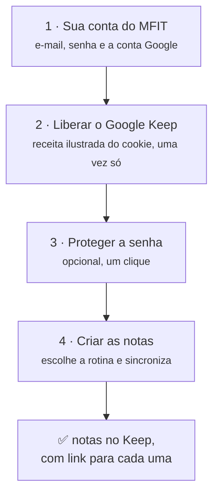
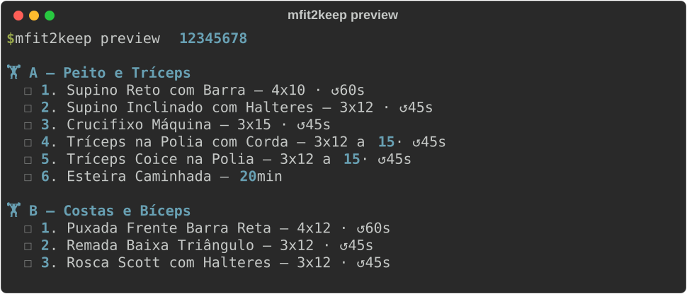
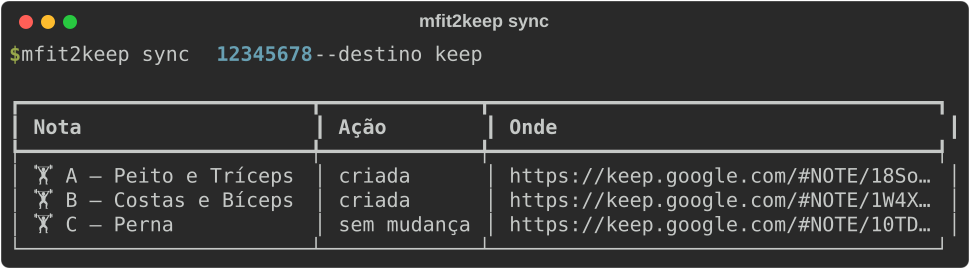
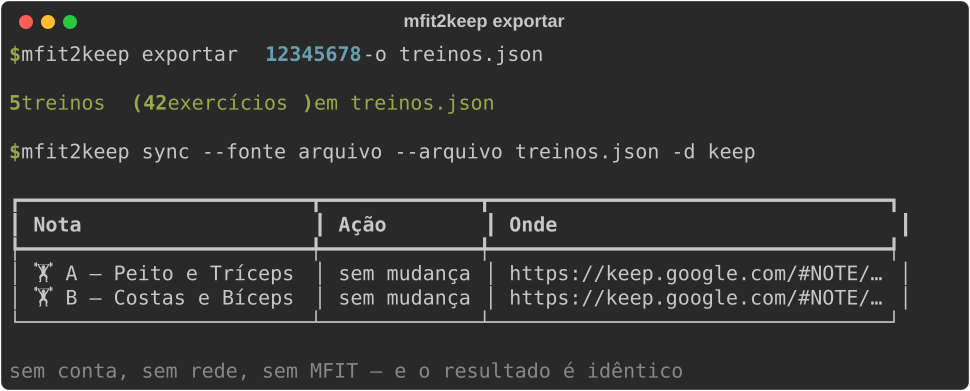
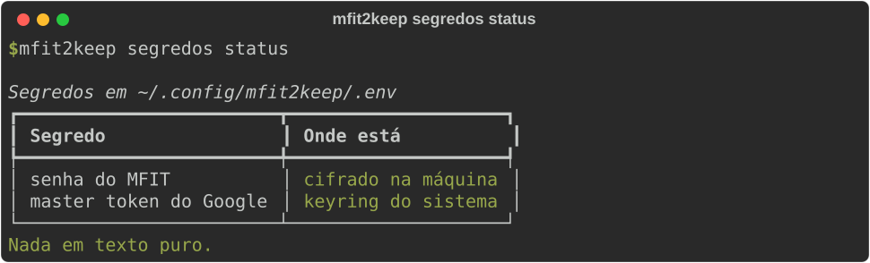

<div align="center">

# 🏋️ mfit2keep

**Seus treinos do [MFIT Personal](https://mfitpersonal.com.br) viram notas com checkbox no Google Keep — para você seguir a série pelo smartwatch, na academia.**

[](https://github.com/Bruno-Mascarenhas/mfit2keep/actions/workflows/ci.yml)
[](#instalação)
[](https://www.python.org/)
[](https://docs.astral.sh/ruff/)
[](https://mypy-lang.org/)
[](https://docs.astral.sh/uv/)
[](tests/)
[](LICENSE)

</div>

---

Abrir o app do MFIT no meio da série é ruim: precisa do celular, precisa de rede, e não dá para
marcar o que já foi feito. O Google Keep tem app nativo no **Wear OS**, funciona offline e o
checkbox é grande o bastante para tocar suado.

O `mfit2keep` lê a sua rotina direto da API do MFIT e cria **uma nota por dia de treino**, com um
checkbox por exercício já no formato certo para a tela do relógio.

**Não precisa saber usar terminal.** Depois de [instalar](#instalação), um comando abre uma tela
guiada que leva do login até as notas prontas no Keep:

<div align="center">
  <table>
    <tr>
      <td width="45%" valign="top" align="center">
        
        <br><sub><b>1.</b> preencha a conta — o número fica verde quando salva</sub>
      </td>
      <td width="55%" valign="top" align="center">
        
        <br><sub><b>2 a 4.</b> a receita do Keep, proteger a senha e criar as notas</sub>
      </td>
    </tr>
  </table>
</div>

```bash
mfit2keep painel
```

> [!TIP]
> Prefere linha de comando? Tudo que a tela faz também está na CLI — veja [Uso](#uso).

---

## Índice

- [Como funciona](#como-funciona)
- [Instalação](#instalação)
- [Configuração](#configuração)
- [Painel no navegador](#painel-no-navegador)
- [Uso](#uso)
- [Sair do MFIT: o formato neutro](#sair-do-mfit-o-formato-neutro)
- [Segredos: tirando a senha do texto puro](#segredos-tirando-a-senha-do-texto-puro)
- [Segurança: como o app sabe o que é dele](#segurança-como-o-app-sabe-o-que-é-dele)
- [Por que `gkeepapi` e não a API oficial](#por-que-gkeepapi-e-não-a-api-oficial)
- [Arquitetura](#arquitetura)
- [Desenvolvimento](#desenvolvimento)
- [Limitações e riscos](#limitações-e-riscos)

## Como funciona



**As duas pontas são plugáveis.** No meio fica `Workout`/`Exercise`, que não conhece nem o MFIT nem
o Keep: trocar qualquer lado é implementar uma interface, sem tocar em render nem em matching. É o
mesmo `Workout` que sai pelo `exportar`, então dá para largar o MFIT sem largar o app.

## Instalação

Roda em **Linux, Windows e macOS** — o CI executa a suíte nos três a cada PR. Precisa de
**Python 3.14+**.

Se ainda não tem o [uv](https://docs.astral.sh/uv/), instale primeiro:

```bash
# Linux e macOS
curl -LsSf https://astral.sh/uv/install.sh | sh
# Windows (PowerShell)
powershell -c "irm https://astral.sh/uv/install.ps1 | iex"
```

Depois:

```bash
git clone https://github.com/Bruno-Mascarenhas/mfit2keep.git
cd mfit2keep

uv venv --python 3.14
source .venv/bin/activate      # Windows: .venv\Scripts\activate
uv pip install -e ".[dev]"
```

> [!NOTE]
> O `activate` não é opcional: sem ele o comando `mfit2keep` não fica disponível.
> Se preferir não ativar nada, todo comando funciona com `uv run` na frente —
> por exemplo `uv run mfit2keep painel`.

<details>
<summary>Com conda para o interpretador</summary>

```bash
conda create -y -n mfit2keep python=3.14
uv pip install --python "$(conda run -n mfit2keep which python)" -e ".[dev]"
conda activate mfit2keep
```

</details>

A CLI fica disponível de duas formas — as duas funcionam de qualquer diretório:

```bash
mfit2keep --help              # script instalado
python -m mfit2keep --help    # sem depender do PATH (útil em cron/container)
```

## Configuração

### 1. MFIT

Copie `.env.example` para `.env` e preencha com o login do
[client.mfitpersonal.com.br](https://client.mfitpersonal.com.br):

```dotenv
MFIT_EMAIL=voce@exemplo.com
MFIT_PASSWORD=sua-senha
```

O app faz login sozinho e guarda o JWT localmente, renovando quando expira. Rodando a partir do
clone, `.env` e estado ficam ao lado do código; instalado como pacote, vão para o lugar que cada
sistema considera correto (`~/.config` e `~/.local/state` no Linux, `%APPDATA%` e `%LOCALAPPDATA%`
no Windows, `Application Support` no macOS).

### 2. Google Keep

A API oficial do Keep **não atende conta pessoal** (veja [abaixo](#por-que-gkeepapi-e-não-a-api-oficial)),
então o acesso é por *master token* — um ritual manual, **uma vez só**.

> [!TIP]
> O [painel](#painel-no-navegador) faz este passo com a receita na tela, em português e sem
> terminal: `mfit2keep painel`. O que vem abaixo é o mesmo ritual, pela linha de comando.

```bash
mfit2keep keep-login
```

O comando guia os passos:

1. Numa **janela anônima**, abra <https://accounts.google.com/EmbeddedSetup>.
2. Faça login e clique em **Eu concordo**. A página fica girando para sempre — é esperado.
3. `F12` → *Application* → *Cookies* → `https://accounts.google.com`.
4. Copie o valor do cookie **`oauth_token`** (começa com `oauth2_4/`) e cole no prompt.

Defina também `GOOGLE_EMAIL` no `.env` — é como o app sabe de qual conta é o token.

> [!IMPORTANT]
> O cookie é de **uso único** e expira em poucos minutos — cole logo depois de copiar.
> O erro nº 1 é colar o cookie direto no `.env`: ele ainda precisa ser trocado pelo master token,
> e o `gkeepapi` só responde `LoginException: Unknown` nesse caso. O `keep-login` faz a troca.

O master token resultante (`aas_et/…`) vai para o **keyring do sistema**. Ele equivale à senha da
conta e não expira, então nunca comite nem coloque em log.

## Painel no navegador

Para quem não quer saber de linha de comando:

```bash
mfit2keep painel
```

Abre o navegador sozinho, numa tela com quatro passos numerados — as telas estão no topo desta
página. O fluxo é este:




O passo 2 é o que costuma travar quem não é técnico, então a tela traz a receita inteira — com o
aviso de que a página do Google **fica girando para sempre** (é normal) e de que o código vale
poucos minutos.

**Como isso é isolado**, já que a tela mexe com senha e master token:

- escuta **só em `127.0.0.1`** — nada de rede, nem do seu roteador;
- toda ação exige um token sorteado a cada execução e entregue na URL. Outra aba aberta no seu
  navegador até consegue fazer `POST` para `localhost`, mas não lê esse token nem manda cabeçalho
  customizado sem passar pelo CORS;
- **nenhum segredo volta para o navegador**: a tela mostra "preenchido"/"cifrado", nunca o valor.

A interface é um HTML, um CSS e um JS em `src/frontend/` — **sem npm, sem build, sem framework**.
Ela é servida pela biblioteca padrão do Python, então não há dependência nova para instalar.

## Uso

```bash
# Quais rotinas existem na fonte
mfit2keep rotinas

# Conferir no terminal antes de subir qualquer coisa
mfit2keep preview 12345678

# Criar/atualizar as notas no Google Keep
mfit2keep sync 12345678 --destino keep

# Ou gerar arquivos Markdown, sem tocar em nenhuma conta
mfit2keep sync 12345678 --destino local -o ./notas

# Apagar só o que o app criou (--arquivar para arquivar em vez de apagar)
mfit2keep limpar --destino keep
```

<div align="center">
  
</div>

### Comandos

| Comando | O que faz |
| --- | --- |
| `painel` | Abre a tela de configuração no navegador |
| `rotinas` | Lista as rotinas disponíveis na fonte |
| `preview` | Mostra no terminal exatamente o que iria para as notas |
| `sync` | Cria/atualiza as notas no destino |
| `exportar` | Grava os treinos no formato neutro, independente de serviço |
| `limpar` | Apaga ou arquiva **só** o que o app criou |
| `keep-login` | Ritual único do master token do Google |
| `segredos status` | Mostra onde cada segredo está guardado |
| `segredos proteger` | Cifra os segredos do `.env` com a cifragem nativa do sistema |

### Ajustes de formatação

A linha é montada pensando na tela do relógio: o **nome do exercício vem primeiro**, porque é o
que sobra quando o texto é truncado.

| Opção | Efeito |
| --- | --- |
| `--sem-numerar` | Tira o `1.`, `2.`, … do começo |
| `--sem-intervalo` | Esconde o descanso (`↺45s`) |
| `--sem-carga` | Esconde a carga prescrita |
| `--largura 40` | Corta a linha em 40 caracteres |

```text
1. Supino Reto com Barra — 4x10 · ↺60s
   ^ nome                  ^ séries  ^ descanso
```

### Sincronizar de novo é seguro

Rodar `sync` outra vez **não duplica** as notas: o app guarda o vínculo entre o treino e a nota.
Se o treino não mudou, a nota nem é tocada. Se mudou, os exercícios que continuam na ficha
**mantêm o checkbox marcado** — dá para sincronizar no meio do treino sem perder o progresso.

O casamento é pelo **nome do exercício**, não pela linha inteira: renumerar a ficha ou mudar a
carga prescrita não zera o que você já marcou.

<div align="center">
  
</div>

## Sair do MFIT: o formato neutro

O `mfit2keep` não te prende ao MFIT. `exportar` grava os treinos num JSON que não pertence a
serviço nenhum, e esse JSON volta a ser uma fonte válida:

<div align="center">
  
</div>

```json
{
  "format": "mfit2keep/workouts",
  "version": 1,
  "workouts": [
    {
      "id": "156902750", "name": "Bíceps/Triceps", "letter": "A",
      "exercises": [
        { "name": "Rosca Direta", "reps": "3x12", "load": "20kg", "rest": "45s" }
      ]
    }
  ]
}
```

Qualquer ferramenta que produza esse JSON já funciona como fonte — planilha, script, outro app.
Só `name` é obrigatório, e o `version` faz um arquivo de versão futura falhar com mensagem clara
em vez de ser lido errado em silêncio.

Para uma fonte nativa nova (outro app de treino), o caminho é implementar `WorkoutSource` — dois
métodos — em `sources/`. Render, matching, marcação e destinos continuam iguais.

## Segredos: tirando a senha do texto puro

Por padrão a senha do MFIT fica em texto puro no `.env`. Se o seu disco não tem criptografia
(a maioria dos desktops não tem), isso significa que **qualquer cópia do disco entrega a
credencial**: backup que subiu para a nuvem, notebook perdido, ou um SSD devolvido em garantia.

<div align="center">
  
</div>

```bash
mfit2keep segredos status              # onde cada segredo está hoje
mfit2keep segredos proteger --escrever # cifra e reescreve o .env
```

O `proteger` usa a cifragem nativa do seu sistema. Em todos os casos a chave fica presa à
**máquina e à conta**, então o blob é lixo em qualquer outro lugar:

| Sistema | Ferramenta | Amarrado a |
| --- | --- | --- |
| Linux | [`systemd-creds --user`](https://www.freedesktop.org/software/systemd/man/systemd-creds.html) | TPM2 da placa + conta |
| Windows | DPAPI (`CryptProtectData`) | perfil do usuário + máquina |
| macOS e outros | — | o app avisa e mantém tudo no keyring |

O `.env` fica assim:

```dotenv
MFIT_PASSWORD_ENC=70rBNnmpSA6n22iJf58WXSAAAAABAAAADAAAABAAAACUiIoXv32WLPJcrlAAAA...
```

O blob é inútil em qualquer outra máquina, decifra sem prompt (**continua funcionando em cron ou
no Agendador de Tarefas**) e o segredo nunca passa por `argv` — só por stdin, para não aparecer
no `ps`.

> [!WARNING]
> Isto protege o **dado em repouso**, não a execução. Um programa malicioso rodando com o seu
> usuário simplesmente chama a mesma API de decifragem que o app. Nenhuma alternativa
> (keyring, sops, age, gpg-agent destravado) muda isso — quem tem o seu usuário tem os seus
> segredos. O ganho real é: disco roubado, backup vazado e `git add -f` acidental deixam de ser
> catástrofe.

Como a chave depende da máquina, **guarde a senha num gerenciador**: reinstalar o sistema, trocar
a placa, limpar o TPM ou recriar o perfil do Windows exige redigitar. Onde não há cifragem nativa,
o comando avisa em vez de fingir que cifrou.

## Segurança: como o app sabe o que é dele

Toda nota criada recebe o label **`mfit2keep`** no Keep (e um carimbo no rodapé, no destino local).

O comando `limpar` seleciona **exclusivamente** pelo label. Nota sem a marca é sua e o app não
encosta nela — isso é testado explicitamente na suíte:

```python
async def test_purge_trashes_only_marked_notes(...):
    minha = client.createList("Lista de compras", [("Café", False)])
    ...
    assert not minha.trashed
```

O destino local tem a mesma garantia por outro caminho: ele **se recusa a sobrescrever** um `.md`
sem o carimbo, em vez de destruir uma anotação sua que por acaso tenha o mesmo nome.

Como o label aparece na barra lateral do Keep, você também consegue filtrar e apagar tudo pela
interface, sem o app.

## Por que `gkeepapi` e não a API oficial

| | API oficial (`keep.googleapis.com`) | `gkeepapi` (não oficial) |
| --- | --- | --- |
| Conta pessoal `@gmail.com` | ❌ *"Not available to users with personal Google accounts"* | ✅ |
| Criar nota com checkbox | ✅ | ✅ |
| **Atualizar** nota | ❌ não existe método `update`/`patch` | ✅ |
| Estabilidade | Oficial, mas 1 release desde 2021 | Reverse-engineered |

A API oficial é exclusiva do Google Workspace e, mesmo lá, só cria e apaga — nunca edita. Para
conta pessoal com atualização de nota, `gkeepapi` é o único caminho que funciona hoje.

**Plano B:** a API do Google Tasks é oficial, gratuita e atende conta pessoal; as tarefas aparecem
no app do Google Agenda para Wear OS. A interface `NoteDestination` existe justamente para essa
troca sair barata. Duas armadilhas se você for por esse caminho: `parent` e `position` são
*output only* (a ordem se define pelos query params `parent`/`previous` no `tasks.insert`), e o
app OAuth precisa estar **"In production"** ou o refresh token morre a cada 7 dias.

## Arquitetura

```
src/mfit2keep/
├── models.py           # Workout · Exercise · ChecklistNote — o meio, sem dependência
├── interchange.py      # formato neutro (JSON): o pivô entre fonte e destino
├── render.py           # Workout  →  ChecklistNote (a linha que cabe no relógio)
├── matching.py         # casa itens antigos/novos sem perder o que foi marcado
├── sources/            # DE ONDE vêm os treinos
│   ├── base.py         #   interface WorkoutSource
│   ├── mfit.py         #   MFIT: junta cliente + parser
│   ├── mfit_api.py     #   cliente async da API (httpx + TaskGroup)
│   ├── mfit_parser.py  #   JSON do MFIT  →  Workout
│   └── workout_file.py #   arquivo no formato neutro
├── destinations/       # PARA ONDE vão as notas
│   ├── base.py         #   interface NoteDestination + a marcação
│   ├── keep.py         #   Google Keep via gkeepapi
│   └── local.py        #   arquivos Markdown
├── config.py           # .env e diretórios por sistema
├── keep_auth.py        # master token: troca, keyring, fallback em arquivo
├── secrets_store.py    # cifragem nativa: systemd-creds (Linux) / DPAPI (Windows)
├── _dpapi.py           # DPAPI via ctypes, sem dependência extra
├── secure_io.py        # escrita restrita e atômica + trava (fcntl/msvcrt)
├── web.py              # painel local: servidor da biblioteca padrão, só em 127.0.0.1
└── cli.py              # Typer + Rich

src/frontend/           # a interface do painel — HTML, CSS e JS, sem build
├── index.html
├── style.css
└── app.js
```

Detalhes que valem saber:

- Os dias da rotina são buscados **em paralelo** com `asyncio.TaskGroup`; o `gkeepapi` é síncrono
  e roda em `asyncio.to_thread` para não travar o loop.
- A ordem dos exercícios exige `sort` inteiro decrescente e explícito. `List.add()` sem `sort`
  embaralha a lista silenciosamente — há teste cobrindo isso.
- O lote inteiro sobe com **um único `sync()`**, para ficar longe de qualquer rate limit.
- O mapa `external_id → id da nota` é gravado sob trava entre processos e **antes** do cache de
  estado: perdê-lo faria a execução seguinte duplicar todas as notas.
- Imports são sempre absolutos (o `ruff` bane relativos), então rodar o arquivo direto funciona.

### API do MFIT

Mapeada a partir do bundle do SPA. Autenticação é `authorization: <jwt>` — **sem** `Bearer`:

| Método | Rota | O que devolve |
| --- | --- | --- |
| `POST` | `/auth/client` | `{token}` a partir de `{mail, senha}` |
| `GET` | `/v2/client/workout/all` | rotinas do aluno |
| `GET` | `/v2/client/workout/?id=<rotina>` | dias da rotina |
| `GET` | `/v2/client/workout/session?id=<dia>` | exercícios e séries |

## Desenvolvimento

```bash
pytest                            # 238 testes
ruff check src tests
ruff format src tests
mypy --platform linux             # o código tem caminho por sistema:
mypy --platform win32             # checar um só deixa metade sem verificação
python docs/make_screenshots.py   # regenera os SVGs do README
```

Os testes do Keep usam um `gkeepapi.Keep` **real** com a rede desligada, então a lógica de
ordenação e de lista é a da biblioteca de verdade — regressão de ordem falha o teste. Os testes
específicos de sistema se auto-pulam onde não se aplicam, e o CI roda a suíte nos três sistemas.

## Limitações e riscos

- **API não oficial.** O `gkeepapi` faz engenharia reversa do protocolo do Keep e pode quebrar a
  qualquer momento. Provavelmente contra os termos de uso do Google.
- **O master token equivale à senha.** Acesso total à conta, sem escopo, e não expira. O Google
  revoga em troca de senha ou evento de "atividade suspeita".
- **A cifragem é presa à máquina.** Trocar de computador exige redigitar os segredos.
- Testado com rotinas do tipo A/B/C/D/E. Circuitos e séries combinadas são reconhecidos, mas
  tiveram menos exposição a dados reais.

## Licença

[MIT](LICENSE)

---

<div align="center">
<sub>Não é um produto oficial do MFIT Personal nem do Google. Marcas pertencem aos seus donos.</sub>
</div>
