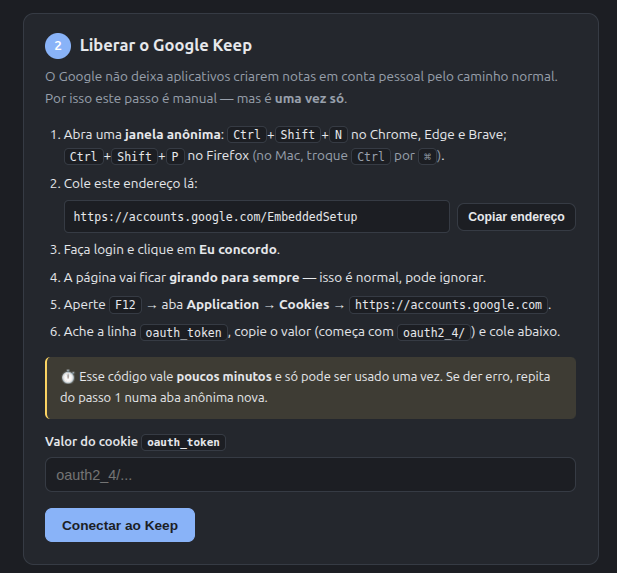
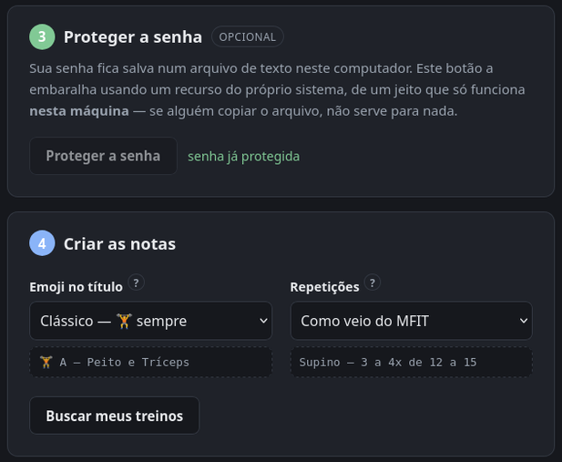

<div align="center">

# 🏋️ mfit2keep

**Seus treinos do [MFIT Personal](https://mfitpersonal.com.br) viram notas com checkbox no Google Keep — para você seguir a série pelo smartwatch, na academia.**

[](https://github.com/Bruno-Mascarenhas/mfit2keep/releases)
[](https://github.com/Bruno-Mascarenhas/mfit2keep/actions/workflows/ci.yml)
[](#instalação)
[](https://www.python.org/)
[](tests/)
[](LICENSE)

</div>

---

Abrir o app do MFIT no meio da série é ruim: precisa do celular, precisa de rede, e não dá para
marcar o que já foi feito. O Google Keep tem app nativo no **Wear OS**, funciona offline e o
checkbox é grande o bastante para tocar suado.

O `mfit2keep` lê a sua rotina direto da API do MFIT e cria **uma nota por dia de treino**, com um
checkbox por exercício já no formato certo para a tela do relógio.

**Não precisa saber usar terminal.** Depois de [instalar](#instalação), um comando abre uma tela
guiada que leva do login até as notas prontas no Keep:

<div align="center">
  <table>
    <tr>
      <td width="33%" valign="top" align="center">
        
        <br><sub><b>1.</b> a conta — o número fica verde quando salva</sub>
      </td>
      <td width="34%" valign="top" align="center">
        
        <br><sub><b>2.</b> a receita do Keep, com o endereço pronto para copiar</sub>
      </td>
      <td width="33%" valign="top" align="center">
        
        <br><sub><b>3 e 4.</b> proteger a senha e criar as notas</sub>
      </td>
    </tr>
  </table>
</div>

```bash
mfit2keep painel
```

> [!TIP]
> Prefere terminal? Tudo que a tela faz também está na CLI — veja
> [Pela linha de comando](#pela-linha-de-comando).

---

## Índice

- [Instalação](#instalação)
- [Pela tela do navegador](#pela-tela-do-navegador)
- [Pela linha de comando](#pela-linha-de-comando)
- [Como a nota fica no relógio](#como-a-nota-fica-no-relógio)
- [Onde ficam os seus dados](#onde-ficam-os-seus-dados)
- [Limitações](#limitações)
- [Documentação técnica](#documentação-técnica)

## Instalação

Roda em **Linux, Windows e macOS** — o CI executa a suíte nos três a cada PR. Precisa de
**Python 3.14+**.

Se ainda não tem o [uv](https://docs.astral.sh/uv/), instale primeiro:

```bash
# Linux e macOS
curl -LsSf https://astral.sh/uv/install.sh | sh
# Windows (PowerShell)
powershell -c "irm https://astral.sh/uv/install.ps1 | iex"
```

Depois:

```bash
git clone https://github.com/Bruno-Mascarenhas/mfit2keep.git
cd mfit2keep

uv venv --python 3.14
source .venv/bin/activate      # Windows: .venv\Scripts\activate
uv pip install -e ".[dev]"
```

> [!NOTE]
> O `activate` não é opcional: sem ele o comando `mfit2keep` não fica disponível.
> Se preferir não ativar nada, todo comando funciona com `uv run` na frente —
> por exemplo `uv run mfit2keep painel`.

<details>
<summary>Com conda para o interpretador</summary>

```bash
conda create -y -n mfit2keep python=3.14
uv pip install --python "$(conda run -n mfit2keep which python)" -e ".[dev]"
conda activate mfit2keep
```

</details>

A CLI fica disponível de duas formas — as duas funcionam de qualquer diretório:

```bash
mfit2keep --help              # script instalado
python -m mfit2keep --help    # sem depender do PATH (útil em cron/container)
```

## Pela tela do navegador

Para quem não quer saber de linha de comando:

```bash
mfit2keep painel
```

Abre o navegador sozinho, numa tela com quatro passos numerados — as telas estão no topo desta
página: a conta do MFIT, liberar o Google Keep, proteger a senha (opcional) e criar as notas, com
link para cada uma no fim.

O passo 2 é o que costuma travar quem não é técnico, então a tela traz a receita inteira — com o
aviso de que a página do Google **fica girando para sempre** (é normal) e de que o código vale
poucos minutos.

A tela é servida pelo seu próprio computador e só escuta em `127.0.0.1`: ela não aparece na rede,
nem para quem está no mesmo Wi-Fi. Nenhum segredo volta para o navegador — a tela mostra
"preenchido" ou "cifrado", nunca o valor. Os detalhes de isolamento estão na
[documentação técnica](docs/README.md#o-painel-por-dentro).

## Pela linha de comando

### Configurar as contas

São as mesmas duas contas do painel — a do MFIT, de onde vêm os treinos, e a do Google, para
onde vão as notas. Se você já passou pela tela, pule para os [comandos](#comandos).

#### 1. MFIT

Copie `.env.example` para `.env` e preencha com o login do
[client.mfitpersonal.com.br](https://client.mfitpersonal.com.br):

```dotenv
MFIT_EMAIL=voce@exemplo.com
MFIT_PASSWORD=sua-senha
GOOGLE_EMAIL=voce@gmail.com
```

O app faz login sozinho e guarda o acesso na sua máquina, renovando quando expira.

#### 2. Google Keep

A API oficial do Keep **não atende conta pessoal**, então o acesso é por *master token* — um
ritual manual, **uma vez só**:

```bash
mfit2keep keep-login
```

O comando guia os passos:

1. Numa **janela anônima**, abra <https://accounts.google.com/EmbeddedSetup>.
2. Faça login e clique em **Eu concordo**. A página fica girando para sempre — é esperado.
3. `F12` → *Application* → *Cookies* → `https://accounts.google.com`.
4. Copie o valor do cookie **`oauth_token`** (começa com `oauth2_4/`) e cole no prompt.

> [!IMPORTANT]
> O cookie é de **uso único** e expira em poucos minutos — cole logo depois de copiar.
> O erro nº 1 é colar o cookie direto no `.env`: ele ainda precisa ser trocado pelo master token.
> O `keep-login` faz essa troca e guarda o resultado no **keyring do sistema**.

### Comandos

Tudo que a tela faz também está na CLI:

```bash
# Quais rotinas existem na sua conta
mfit2keep rotinas

# Conferir no terminal antes de subir qualquer coisa
mfit2keep preview 12345678

# Criar/atualizar as notas no Google Keep
mfit2keep sync 12345678 --destino keep

# Um emoji por grupo muscular no título, e sempre o piso da faixa de repetições
mfit2keep sync 12345678 --destino keep --styles musculos --reps min

# Ou gerar arquivos Markdown, sem tocar em nenhuma conta
mfit2keep sync 12345678 --destino local -o ./notas

# Levar os treinos embora, num JSON que não pertence a serviço nenhum
mfit2keep exportar 12345678 -o treinos.json
mfit2keep sync --fonte arquivo --arquivo treinos.json --destino keep

# Apagar só o que o app criou (--arquivar para arquivar em vez de apagar)
mfit2keep limpar --destino keep
```

<div align="center">
  
</div>

| Comando | O que faz |
| --- | --- |
| `painel` | Abre a tela de configuração no navegador |
| `rotinas` | Lista as rotinas disponíveis na sua conta |
| `preview` | Mostra no terminal exatamente o que iria para as notas |
| `sync` | Cria/atualiza as notas no destino |
| `exportar` | Grava os treinos num JSON independente de serviço |
| `limpar` | Apaga ou arquiva **só** o que o app criou |
| `keep-login` | Ritual único do master token do Google |
| `segredos status` | Mostra onde cada segredo está guardado |
| `segredos proteger` | Cifra os segredos do `.env` com a cifragem nativa do sistema |

### Sincronizar de novo é seguro

Rodar `sync` outra vez **não duplica** as notas: o app guarda o vínculo entre o treino e a nota.
Se o treino não mudou, a nota nem é tocada. Se mudou, os exercícios que continuam na ficha
**mantêm o checkbox marcado** — dá para sincronizar no meio do treino sem perder o progresso.

O casamento é pelo **nome do exercício**, não pela linha inteira: renumerar a ficha ou mudar a
carga prescrita não zera o que você já marcou.

<div align="center">
  
</div>

## Como a nota fica no relógio

A linha é montada pensando na tela pequena: o **nome do exercício vem primeiro**, porque é o que
sobra quando o texto é truncado.

```text
🏋️ A — Peito e Tríceps
1. Supino Reto com Barra — 4x10 · ↺60s
   ^ nome                  ^ séries  ^ descanso
6. Esteira Caminhada — 20 min  ← no aeróbio, "repetições" são minutos
```

Os minutos do aeróbio não são opção: ali o campo de repetições do MFIT traz tempo, e `35` sem
unidade é só um número solto na tela.

| Opção | Efeito |
| --- | --- |
| `--sem-numerar` | Tira o `1.`, `2.`, … do começo |
| `--sem-intervalo` | Esconde o descanso (`↺45s`) |
| `--sem-carga` | Esconde a carga prescrita |
| `--largura 40` | Corta a linha em 40 caracteres |
| `--styles` | O emoji do título — abaixo |
| `--reps` | A faixa de repetições — abaixo |

### `--styles`: o emoji do título

Na lista do relógio o título é quase tudo que se vê, e cinco notas com o mesmo ícone obrigam a ler
uma por uma.

| Valor | Como fica |
| --- | --- |
| `classico` *(padrão)* | `🏋️ A — Peito e Tríceps` — o mesmo halteres em todos os dias |
| `musculos` | `🐦💪 A — Peito e Tríceps` — um emoji por grupo muscular |
| `clean` | `A — Peito e Tríceps` — sem emoji nenhum |

O `musculos` usa 💪 braço, 🦍 costas, 🦵 perna, 🐦 peito, 🙌 ombro, 🍑 glúteo, 🔥 abdômen,
🏃 aeróbio e 🧘 mobilidade — costas de gorila e peito de pombo, como se fala na academia.

### `--reps`: qual ponta da faixa

O professor prescreve faixa (`3 a 4x de 12 a 15`); no meio da série você quer um número.

| Valor | `3 a 4x de 12 a 15` vira | `35` (esteira) vira |
| --- | --- | --- |
| `mfit` *(padrão)* | `3 a 4x de 12 a 15` | `35 min` |
| `min` | `3x12` | `35 min` |
| `max` | `4x15` | `35 min` |

O que o professor escreveu além da conta (`3T`, `+ 20 ISO`) continua inteiro, e sequência de séries
— drop-set `3x12/10/8`, pirâmide `3x12-10-8` — passa intacta nos três modos. As regras completas
estão na [documentação técnica](docs/README.md#como-a-linha-é-montada).

### Na ordem dos dias

As notas saem na ordem da rotina (A, B, C…), num bloco no topo da lista do Keep, no celular e no
relógio. Sincronizar de novo não bagunça nem reescreve o que já está no lugar.

> [!NOTE]
> O Keep do Android tem um seletor de ordenação (**Personalizada**, *Data de criação*, *Data de
> modificação*). A ordem que o app grava só vale na **Personalizada** — se a sua lista estiver
> fora de ordem, confira essa opção no app. O porquê está na
> [documentação técnica](docs/README.md#a-ordem-das-notas-no-keep).

## Onde ficam os seus dados

**Não existe servidor deste app.** Nada é enviado para lugar nenhum além do próprio MFIT (para ler
os treinos) e do próprio Google (para escrever as notas) — não há telemetria, conta, nuvem nem
intermediário.

Suas credenciais ficam **só na sua máquina**: a senha do MFIT no `.env`, o token do Google no
keyring do sistema. Um comando tira a senha do texto puro, usando a cifragem que o seu sistema já
tem (o TPM da placa no Linux, o DPAPI no Windows):

```bash
mfit2keep segredos status              # onde cada segredo está hoje
mfit2keep segredos proteger --escrever # cifra e reescreve o .env
```

<div align="center">
  
</div>

A chave fica presa à máquina e à conta, então uma cópia do `.env` não serve para nada em outro
computador — **guarde a senha num gerenciador**, porque reinstalar o sistema exige redigitar. No
macOS não há cifragem nativa equivalente: lá o comando avisa em vez de fingir que cifrou, e o
master token continua no keyring. O que essa cifragem **não** protege está na
[documentação técnica](docs/README.md#segredos-tirando-a-senha-do-texto-puro).

E o app só mexe no que é dele: toda nota criada recebe o label **`mfit2keep`**, e o `limpar`
seleciona exclusivamente por ele. Nota sua nunca é tocada.

## Limitações

- **API não oficial.** O `gkeepapi` faz engenharia reversa do protocolo do Keep e pode quebrar a
  qualquer momento. Provavelmente contra os termos de uso do Google.
- **O master token equivale à senha** da sua conta Google: acesso total, sem escopo, e não expira.
  O Google revoga quando você troca a senha.
- **A cifragem é presa à máquina.** Trocar de computador exige redigitar os segredos.
- Testado com rotinas do tipo A/B/C/D/E. Circuitos e séries combinadas são reconhecidos, mas
  tiveram menos exposição a dados reais.

## Documentação técnica

Arquitetura, formato neutro de treino, o mapeamento da API do MFIT, os detalhes de segurança e
como rodar os testes: **[docs/README.md](docs/README.md)**.

## Licença

[MIT](LICENSE)

---

<div align="center">
<sub>Não é um produto oficial do MFIT Personal nem do Google. Marcas pertencem aos seus donos.</sub>
</div>
