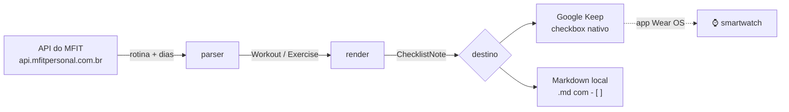

<div align="center">

# 🏋️ mfit2keep

**Seus treinos do [MFIT Personal](https://mfitpersonal.com.br) viram notas com checkbox no Google Keep — para você seguir a série pelo smartwatch, na academia.**

[](https://github.com/Bruno-Mascarenhas/mfit2keep/actions/workflows/ci.yml)
[](https://www.python.org/)
[](https://docs.astral.sh/ruff/)
[](https://mypy-lang.org/)
[](https://docs.astral.sh/uv/)
[](tests/)
[](LICENSE)

</div>

---

Abrir o app do MFIT no meio da série é ruim: precisa do celular, precisa de rede, e não dá para
marcar o que já foi feito. O Google Keep tem app nativo no **Wear OS**, funciona offline e o
checkbox é grande o bastante para tocar suado.

O `mfit2keep` lê a sua rotina direto da API do MFIT e cria **uma nota por dia de treino**, com um
checkbox por exercício já no formato certo para a tela do relógio.

<div align="center">
  
</div>

---

## Índice

- [Como funciona](#como-funciona)
- [Instalação](#instalação)
- [Configuração](#configuração)
- [Uso](#uso)
- [Segredos: tirando a senha do texto puro](#segredos-tirando-a-senha-do-texto-puro)
- [Segurança: como o app sabe o que é dele](#segurança-como-o-app-sabe-o-que-é-dele)
- [Por que `gkeepapi` e não a API oficial](#por-que-gkeepapi-e-não-a-api-oficial)
- [Arquitetura](#arquitetura)
- [Desenvolvimento](#desenvolvimento)
- [Limitações e riscos](#limitações-e-riscos)

## Como funciona



O modelo de domínio (`Workout`, `Exercise`, `ChecklistNote`) não sabe nada nem do MFIT nem do
Keep. Trocar o destino é implementar uma interface de dois métodos.

## Instalação

Precisa de **Python 3.14+**. O projeto usa conda para o interpretador e [uv](https://docs.astral.sh/uv/)
para as dependências:

```bash
git clone https://github.com/Bruno-Mascarenhas/mfit2keep.git
cd mfit2keep

conda create -y -n mfit2keep python=3.14
uv pip install --python "$(conda run -n mfit2keep which python)" -e ".[dev]"
conda activate mfit2keep
```

<details>
<summary>Só com <code>uv</code>, sem conda</summary>

```bash
uv venv --python 3.14
uv pip install -e ".[dev]"
source .venv/bin/activate
```

</details>

## Configuração

### 1. MFIT

Copie `.env.example` para `.env` e preencha com o login do
[client.mfitpersonal.com.br](https://client.mfitpersonal.com.br):

```dotenv
MFIT_EMAIL=voce@exemplo.com
MFIT_PASSWORD=sua-senha
```

O app faz login sozinho e guarda o JWT em `.state/`, renovando quando expira.

### 2. Google Keep

A API oficial do Keep **não atende conta pessoal** (veja [abaixo](#por-que-gkeepapi-e-não-a-api-oficial)),
então o acesso é por *master token* — um ritual manual, **uma vez só**:

```bash
mfit2keep keep-login
```

O comando guia os passos:

1. Numa **janela anônima**, abra <https://accounts.google.com/EmbeddedSetup>.
2. Faça login e clique em **Eu concordo**. A página fica girando para sempre — é esperado.
3. `F12` → *Application* → *Cookies* → `https://accounts.google.com`.
4. Copie o valor do cookie **`oauth_token`** (começa com `oauth2_4/`) e cole no prompt.

> [!IMPORTANT]
> O cookie é de **uso único** e expira em poucos minutos — cole logo depois de copiar.
> O erro nº 1 é colar o cookie direto no `.env`: ele ainda precisa ser trocado pelo master token,
> e o `gkeepapi` só responde `LoginException: Unknown` nesse caso. O `keep-login` faz a troca.

O master token resultante (`aas_et/…`) vai para o **keyring do sistema**. Ele equivale à senha da
conta e não expira, então nunca comite nem coloque em log.

## Uso

```bash
# Quais rotinas existem na sua conta
mfit2keep rotinas

# Conferir no terminal antes de subir qualquer coisa
mfit2keep preview 12345678

# Criar/atualizar as notas no Google Keep
mfit2keep sync 12345678 --destino keep

# Ou gerar arquivos Markdown, sem tocar em nenhuma conta
mfit2keep sync 12345678 --destino local -o ./notas

# Apagar só o que o app criou (--arquivar para arquivar em vez de apagar)
mfit2keep limpar --destino keep
mfit2keep limpar --destino keep --arquivar
```

<div align="center">
  
</div>

### Ajustes de formatação

A linha é montada pensando na tela do relógio: o **nome do exercício vem primeiro**, porque é o
que sobra quando o texto é truncado.

| Opção | Efeito |
| --- | --- |
| `--sem-numerar` | Tira o `1.`, `2.`, … do começo |
| `--sem-intervalo` | Esconde o descanso (`↺45s`) |
| `--sem-carga` | Esconde a carga prescrita |
| `--largura 40` | Corta a linha em 40 caracteres |

```text
1. Supino Reto com Barra — 4x10 · ↺60s
   ^ nome                  ^ séries  ^ descanso
```

### Sincronizar de novo é seguro

Rodar `sync` outra vez **não duplica** as notas: o app guarda o vínculo entre o treino e a nota.
Se o treino não mudou, a nota nem é tocada. Se mudou, os exercícios que continuam na ficha
**mantêm o checkbox marcado** — dá para sincronizar no meio do treino sem perder o progresso.

## Segredos: tirando a senha do texto puro

Por padrão a senha do MFIT fica em texto puro no `.env`. Se o seu disco não tem criptografia
(a maioria dos desktops Linux não tem), isso significa que **qualquer cópia do disco entrega a
credencial**: backup que subiu para a nuvem, notebook perdido, ou um SSD devolvido em garantia.

```bash
mfit2keep segredos status              # onde cada segredo está hoje
mfit2keep segredos proteger --escrever # cifra e reescreve o .env
```

O `proteger` usa o [`systemd-creds`](https://www.freedesktop.org/software/systemd/man/systemd-creds.html)
no escopo do usuário, que amarra a chave ao **TPM2 desta placa**. O `.env` fica assim:

```dotenv
MFIT_PASSWORD_ENC=70rBNnmpSA6n22iJf58WXSAAAAABAAAADAAAABAAAACUiIoXv32WLPJcrlAAAA...
```

O blob é inútil em qualquer outra máquina, e o app decifra sozinho — **sem prompt, então continua
funcionando em cron**. O segredo nunca passa por `argv` (visível no `ps`), só por stdin.

> [!WARNING]
> Isto protege o **dado em repouso**, não a execução. Um programa malicioso rodando com o seu
> usuário simplesmente chama `systemd-creds decrypt`, igual ao app. Nenhuma alternativa
> (keyring, sops, age, gpg-agent destravado) muda isso — quem tem o seu UID tem os seus segredos.
> O ganho real é: disco roubado, backup vazado e `git add -f` acidental deixam de ser catástrofe.

Como a chave depende do TPM desta placa, **guarde a senha num gerenciador**: reinstalar o sistema,
trocar a placa ou limpar o TPM exige redigitar. Sem `systemd-creds` na máquina, o master token
continua no keyring do sistema e o comando avisa em vez de fingir que cifrou.

## Segurança: como o app sabe o que é dele

Toda nota criada recebe o label **`mfit2keep`** no Keep (e um carimbo no rodapé, no destino local).

O comando `limpar` seleciona **exclusivamente** pelo label. Nota sem a marca é sua e o app não
encosta nela — isso é testado explicitamente na suíte:

```python
async def test_purge_trashes_only_marked_notes(...):
    minha = client.createList("Lista de compras", [("Café", False)])
    ...
    assert not minha.trashed
```

Como o label aparece na barra lateral do Keep, você também consegue filtrar e apagar tudo pela
interface, sem o app.

## Por que `gkeepapi` e não a API oficial

| | API oficial (`keep.googleapis.com`) | `gkeepapi` (não oficial) |
| --- | --- | --- |
| Conta pessoal `@gmail.com` | ❌ *"Not available to users with personal Google accounts"* | ✅ |
| Criar nota com checkbox | ✅ | ✅ |
| **Atualizar** nota | ❌ não existe método `update`/`patch` | ✅ |
| Estabilidade | Oficial, mas 1 release desde 2021 | Reverse-engineered |

A API oficial é exclusiva do Google Workspace e, mesmo lá, só cria e apaga — nunca edita. Para
conta pessoal com atualização de nota, `gkeepapi` é o único caminho que funciona hoje.

**Plano B:** a API do Google Tasks é oficial, gratuita e atende conta pessoal; as tarefas aparecem
no app do Google Agenda para Wear OS. A interface `NoteDestination` existe justamente para essa
troca sair barata. Duas armadilhas se você for por esse caminho: `parent` e `position` são
*output only* (a ordem se define pelos query params `parent`/`previous` no `tasks.insert`), e o
app OAuth precisa estar **"In production"** ou o refresh token morre a cada 7 dias.

## Arquitetura

```
src/mfit2keep/
├── mfit.py           # cliente async da API do MFIT (httpx + TaskGroup)
├── parser.py         # JSON do MFIT  →  Workout / Exercise
├── render.py         # Workout       →  ChecklistNote (formato do relógio)
├── models.py         # domínio puro, sem dependência de destino
├── keep_auth.py      # master token: troca, keyring, fallback em arquivo
├── secrets_store.py  # cifragem dos segredos com systemd-creds (TPM2)
├── secure_io.py      # escrita 0600 atômica + trava entre processos
├── matching.py       # casa itens antigos/novos sem perder o que foi marcado
├── destinations/
│   ├── base.py       # interface NoteDestination + marcação
│   ├── keep.py       # Google Keep via gkeepapi
│   └── local.py      # arquivos Markdown
└── cli.py            # Typer + Rich
```

Detalhes que valem saber:

- Os dias da rotina são buscados **em paralelo** com `asyncio.TaskGroup`; o `gkeepapi` é síncrono
  e roda em `asyncio.to_thread` para não travar o loop.
- A ordem dos exercícios exige `sort` inteiro decrescente e explícito. `List.add()` sem `sort`
  embaralha a lista silenciosamente — há teste cobrindo isso.
- O lote inteiro sobe com **um único `sync()`**, para ficar longe de qualquer rate limit.

### API do MFIT

Mapeada a partir do bundle do SPA. Autenticação é `authorization: <jwt>` — **sem** `Bearer`:

| Método | Rota | O que devolve |
| --- | --- | --- |
| `POST` | `/auth/client` | `{token}` a partir de `{mail, senha}` |
| `GET` | `/v2/client/workout/all` | rotinas do aluno |
| `GET` | `/v2/client/workout/?id=<rotina>` | dias da rotina |
| `GET` | `/v2/client/workout/session?id=<dia>` | exercícios e séries |

## Desenvolvimento

```bash
pytest              # 166 testes
ruff check src tests
ruff format src tests
mypy                # strict
```

Os testes do Keep usam um `gkeepapi.Keep` **real** com a rede desligada, então a lógica de
ordenação e de lista é a da biblioteca de verdade — regressão de ordem falha o teste.

## Limitações e riscos

- **API não oficial.** O `gkeepapi` faz engenharia reversa do protocolo do Keep e pode quebrar a
  qualquer momento. Provavelmente contra os termos de uso do Google.
- **O master token equivale à senha.** Acesso total à conta, sem escopo, e não expira. O Google
  revoga em troca de senha ou evento de "atividade suspeita".
- **Um nível de aninhamento.** O Keep aceita sub-itens só um nível abaixo.
- Testado com rotinas do tipo A/B/C/D/E. Circuitos e séries combinadas são reconhecidos, mas
  tiveram menos exposição a dados reais.

## Licença

[MIT](LICENSE)

---

<div align="center">
<sub>Não é um produto oficial do MFIT Personal nem do Google. Marcas pertencem aos seus donos.</sub>
</div>
