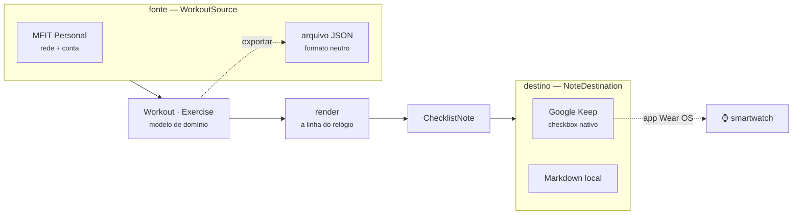

<div align="center">

# mfit2keep — documentação técnica

**Como o app é feito por dentro: arquitetura, formatos, segurança e os detalhes que só aparecem
quando alguém vai mexer no código.**

[](https://docs.astral.sh/ruff/)
[](https://mypy-lang.org/)
[](https://docs.astral.sh/uv/)
[](../tests/)

[Instalar e usar](../README.md) · [Arquitetura](#arquitetura) · [Segurança](#segredos-tirando-a-senha-do-texto-puro)

</div>

---

## Índice

- [Como funciona](#como-funciona)
- [Arquitetura](#arquitetura)
- [O formato neutro de treino](#o-formato-neutro-de-treino)
- [Como a linha é montada](#como-a-linha-é-montada)
- [A ordem das notas no Keep](#a-ordem-das-notas-no-keep)
- [Segredos: tirando a senha do texto puro](#segredos-tirando-a-senha-do-texto-puro)
- [Como o app sabe o que é dele](#como-o-app-sabe-o-que-é-dele)
- [O painel por dentro](#o-painel-por-dentro)
- [Por que `gkeepapi` e não a API oficial](#por-que-gkeepapi-e-não-a-api-oficial)
- [A API do MFIT](#a-api-do-mfit)
- [Desenvolvimento](#desenvolvimento)
- [Limitações e riscos](#limitações-e-riscos)

## Como funciona



**As duas pontas são plugáveis.** No meio fica `Workout`/`Exercise`, que não conhece nem o MFIT nem
o Keep: trocar qualquer lado é implementar uma interface, sem tocar em render nem em matching. É o
mesmo `Workout` que sai pelo `exportar`, então dá para largar o MFIT sem largar o app.

## Arquitetura

```
src/mfit2keep/
├── models.py           # Workout · Exercise · ChecklistNote — o meio, sem dependência
├── interchange.py      # formato neutro (JSON): o pivô entre fonte e destino
├── render.py           # Workout  →  ChecklistNote (a linha que cabe no relógio)
├── muscles.py          # o que o dia trabalha: o emoji do título e o que é cardio
├── matching.py         # casa itens antigos/novos sem perder o que foi marcado
├── sources/            # DE ONDE vêm os treinos
│   ├── base.py         #   interface WorkoutSource
│   ├── mfit.py         #   MFIT: junta cliente + parser
│   ├── mfit_api.py     #   cliente async da API (httpx + TaskGroup)
│   ├── mfit_parser.py  #   JSON do MFIT  →  Workout
│   └── workout_file.py #   arquivo no formato neutro
├── destinations/       # PARA ONDE vão as notas
│   ├── base.py         #   interface NoteDestination + a marcação
│   ├── keep.py         #   Google Keep via gkeepapi
│   └── local.py        #   arquivos Markdown
├── config.py           # .env e diretórios por sistema
├── keep_auth.py        # master token: troca, keyring, fallback em arquivo
├── secrets_store.py    # cifragem nativa: systemd-creds (Linux) / DPAPI (Windows)
├── _dpapi.py           # DPAPI via ctypes, sem dependência extra
├── errors.py           # o que vira mensagem e o que sobe — política única
├── secure_io.py        # escrita restrita e atômica + trava (fcntl/msvcrt)
├── web.py              # painel local: servidor da biblioteca padrão, só em 127.0.0.1
└── cli.py              # Typer + Rich

src/frontend/           # a interface do painel — HTML, CSS e JS, sem build
├── index.html
├── style.css
└── app.js
```

Detalhes que valem saber:

- Os dias da rotina são buscados **em paralelo** com `asyncio.TaskGroup`; o `gkeepapi` é síncrono
  e roda em `asyncio.to_thread` para não travar o loop.
- A ordem dos exercícios exige `sort` inteiro decrescente e explícito. `List.add()` sem `sort`
  embaralha a lista silenciosamente — há teste cobrindo isso.
- A ordem das **notas** tem o mesmo problema um nível acima — veja
  [A ordem das notas no Keep](#a-ordem-das-notas-no-keep).
- O lote inteiro sobe com **um único `sync()`**, para ficar longe de qualquer rate limit.
- O mapa `external_id → id da nota` é gravado sob trava entre processos e **antes** do cache de
  estado: perdê-lo faria a execução seguinte duplicar todas as notas.
- O casamento de checkbox usa uma *chave* (o nome do exercício), não a linha inteira: renumerar a
  ficha, mudar a carga ou trocar `--reps` não pode zerar o que o usuário marcou no relógio.
- Imports são sempre absolutos (o `ruff` bane relativos), então rodar o arquivo direto funciona.

### Onde ficam os arquivos

Rodando a partir do clone, `.env` e estado ficam ao lado do código. Instalado como pacote, vão
para o lugar que cada sistema considera correto: `~/.config` e `~/.local/state` no Linux,
`%APPDATA%` e `%LOCALAPPDATA%` no Windows, `Application Support` no macOS.

## O formato neutro de treino

O `mfit2keep` não te prende ao MFIT. `exportar` grava os treinos num JSON que não pertence a
serviço nenhum, e esse JSON volta a ser uma fonte válida:

<div align="center">
  
</div>

```json
{
  "format": "mfit2keep/workouts",
  "version": 1,
  "workouts": [
    {
      "id": "156902750", "name": "Bíceps/Triceps", "letter": "A",
      "exercises": [
        {
          "name": "Rosca Direta", "reps": "3x12", "load": "20kg",
          "rest": "45s", "muscle_group": "Bíceps"
        }
      ]
    }
  ]
}
```

Qualquer ferramenta que produza esse JSON já funciona como fonte — planilha, script, outro app.
Só `name` é obrigatório, e o `version` faz um arquivo de versão futura falhar com mensagem clara
em vez de ser lido errado em silêncio. O `muscle_group` é opcional: é o que dá o emoji do título
quando o nome do treino não entrega o grupo, e o que marca o aeróbio (cujas repetições são
minutos) — sem ele, o nome do exercício ainda resolve os dois casos.

Para uma fonte nativa nova (outro app de treino), o caminho é implementar `WorkoutSource` — dois
métodos — em `sources/`. Render, matching, marcação e destinos continuam iguais.

## Como a linha é montada

`render.py` transforma o `Workout` na `ChecklistNote`. O alvo é uma tela de 1,2": o nome do
exercício vem primeiro, porque é o que sobra quando o texto é truncado.

**O emoji do título** (`--styles musculos`) sai de `muscles.py`, que casa radicais sem acento
contra o nome do treino — `costa` pega "Costas", `abdomin` pega "Abdominais". Quando o nome não
entrega nada ("Treino A"), o emoji vem do grupo que mais aparece na ficha; são no máximo dois, que
é o que cabe. Abdômen e aeróbio só nomeiam o dia quando não há mais nada, porque fecham todo
treino. Sem nenhuma pista, fica o 🏋️.

Dois cuidados no vocabulário, ambos com teste: o `_TRAPS` desfaz nomes em que o radical curto
engana (o músculo da coxa também se chama "bíceps", o da panturrilha, "tríceps"), e o grupo
declarado pela fonte é consultado **antes** do nome — mais confiável, quando existe.

O conjunto de emojis fica todo em Emoji 11.0 ou anterior, coloridos por padrão. O único que depende
do seletor de variação `U+FE0F` é o 🏋️ do estilo clássico: se alguma camada engolir o seletor, ele
cai no fallback monocromático em vez de virar caixinha.

**A faixa de repetições** (`--reps min|max`) é reduzida por regex, e ela desiste em dois casos —
porque encurtar ali apagaria treino:

| Entrada | `min` | Por quê |
| --- | --- | --- |
| `3 a 4x de 12 a 15` | `3x12` | faixa de verdade |
| `3x12 a 15 3T` | `3x12 3T` | o extra do professor sai intacto |
| `3x12-10-8` | `3x12-10-8` | pirâmide: sequência de séries, não faixa |
| `3x12 a 40kg` | `3x12 a 40kg` | número colado numa letra é unidade, não a ponta da faixa |

Os quantificadores são possessivos (`\d++`) de propósito: com `\d+`, o motor recuava dentro do
número para satisfazer a checagem seguinte e transformava `3x12-10-8` em `3x12-1` seguido de lixo.

**Os minutos do aeróbio** não são opção: o MFIT guarda a duração no mesmo campo `repeticao`, e
`35` sem unidade é só um número solto na tela.

## A ordem das notas no Keep

O Keep guarda a posição de cada nota num campo próprio, o **`sortValue`** — maior em cima. É o
número que ele reescreve quando você arrasta uma nota na tela, e o `gkeepapi` **sorteia** esse
valor em toda nota nova (`random.randint(1000000000, 9999999999)`). Cinco notas criadas pelo mesmo
`sync` caíam, então, em cinco lugares aleatórios da lista.

O `_order` de `destinations/keep.py` passa a gravar o campo explicitamente:

- **decrescente**, do primeiro dia para o último, com passo `2^20` — o mesmo espaçamento que o
  cliente oficial usa ao arrastar uma nota;
- **ancorado acima das outras notas** da conta, que é onde o Keep põe qualquer nota recém-criada.
  Assim nenhuma nota alheia cai entre o treino A e o B;
- **idempotente**: bloco que já está no lugar não é reescrito, então o `sync` seguinte não vira
  upload. Notas arquivadas e na lixeira não entram na conta da âncora.

Duas coisas que **não** funcionam, testadas contra a conta real:

- *espaçar as datas de edição* (para cobrir quem ordena por "data de modificação"): o servidor do
  Keep carimba o `userEdited` dele por cima do que a API manda, e as notas de um mesmo `sync`
  voltam todas com o mesmo horário;
- *prefixo numérico no título* (`01 -`, `02 -`): o Keep não tem ordenação alfabética em modo
  nenhum.

O `sortValue` só governa a lista no modo **Personalizada** do seletor de ordenação que o Keep para
Android ganhou em 2025. Nos outros dois modos a ordem vem de timestamps do servidor, fora do
alcance da API.

## Segredos: tirando a senha do texto puro

Por padrão a senha do MFIT fica em texto puro no `.env`. Se o seu disco não tem criptografia
(a maioria dos desktops não tem), isso significa que **qualquer cópia do disco entrega a
credencial**: backup que subiu para a nuvem, notebook perdido, ou um SSD devolvido em garantia.

<div align="center">
  
</div>

```bash
mfit2keep segredos status              # onde cada segredo está hoje
mfit2keep segredos proteger --escrever # cifra e reescreve o .env
```

O `proteger` usa a cifragem nativa do seu sistema. Em todos os casos a chave fica presa à
**máquina e à conta**, então o blob é lixo em qualquer outro lugar:

| Sistema | Ferramenta | Amarrado a |
| --- | --- | --- |
| Linux | [`systemd-creds --user`](https://www.freedesktop.org/software/systemd/man/systemd-creds.html) | TPM2 da placa + conta |
| Windows | DPAPI (`CryptProtectData`) | perfil do usuário + máquina |
| macOS e outros | — | o app avisa e mantém tudo no keyring |

O `.env` fica assim:

```dotenv
MFIT_PASSWORD_ENC=70rBNnmpSA6n22iJf58WXSAAAAABAAAADAAAABAAAACUiIoXv32WLPJcrlAAAA...
```

O blob é inútil em qualquer outra máquina, decifra sem prompt (**continua funcionando em cron ou
no Agendador de Tarefas**) e o segredo nunca passa por `argv` — só por stdin, para não aparecer
no `ps`.

O master token do Google (`aas_et/…`) segue outro caminho: vai para o **keyring do sistema**, com
fallback para arquivo restrito onde não houver keyring.

> [!WARNING]
> Isto protege o **dado em repouso**, não a execução. Um programa malicioso rodando com o seu
> usuário simplesmente chama a mesma API de decifragem que o app. Nenhuma alternativa
> (keyring, sops, age, gpg-agent destravado) muda isso — quem tem o seu usuário tem os seus
> segredos. O ganho real é: disco roubado, backup vazado e `git add -f` acidental deixam de ser
> catástrofe.

Como a chave depende da máquina, **guarde a senha num gerenciador**: reinstalar o sistema, trocar
a placa, limpar o TPM ou recriar o perfil do Windows exige redigitar. Onde não há cifragem nativa,
o comando avisa em vez de fingir que cifrou.

## Como o app sabe o que é dele

Toda nota criada recebe o label **`mfit2keep`** no Keep (e um carimbo no rodapé, no destino local).

O comando `limpar` seleciona **exclusivamente** pelo label. Nota sem a marca é do usuário e o app
não encosta nela — isso é testado explicitamente na suíte:

```python
async def test_purge_trashes_only_marked_notes(...):
    minha = client.createList("Lista de compras", [("Café", False)])
    ...
    assert not minha.trashed
```

O mesmo label também protege a atualização: se o `id` guardado no mapa local apontar para uma nota
sem a marca (por exemplo, porque o usuário trocou de conta Google), o app cria uma nota nova em
vez de reescrever algo que não é dele.

O destino local tem a mesma garantia por outro caminho: ele **se recusa a sobrescrever** um `.md`
sem o carimbo, em vez de destruir uma anotação do usuário que por acaso tenha o mesmo nome.

Como o label aparece na barra lateral do Keep, dá para filtrar e apagar tudo pela interface, sem
o app.

## O painel por dentro

A tela mexe com senha e master token, então o servidor local é fechado em três frentes:

- escuta **só em `127.0.0.1`** — não aparece na rede, nem para quem está no mesmo Wi-Fi;
- toda ação exige um token sorteado a cada execução e entregue na URL. Outra aba aberta no
  navegador até consegue fazer `POST` para `localhost`, mas não lê esse token nem manda cabeçalho
  customizado sem passar pelo CORS;
- **nenhum segredo volta para o navegador**: a tela mostra "preenchido"/"cifrado", nunca o valor.

A interface é um HTML, um CSS e um JS em `src/frontend/` — **sem npm, sem build, sem framework**.
Ela é servida pela biblioteca padrão do Python, então não há dependência nova para instalar.

## Por que `gkeepapi` e não a API oficial

| | API oficial (`keep.googleapis.com`) | `gkeepapi` (não oficial) |
| --- | --- | --- |
| Conta pessoal `@gmail.com` | ❌ *"Not available to users with personal Google accounts"* | ✅ |
| Criar nota com checkbox | ✅ | ✅ |
| **Atualizar** nota | ❌ não existe método `update`/`patch` | ✅ |
| Estabilidade | Oficial, mas 1 release desde 2021 | Reverse-engineered |

A API oficial é exclusiva do Google Workspace e, mesmo lá, só cria e apaga — nunca edita. Para
conta pessoal com atualização de nota, `gkeepapi` é o único caminho que funciona hoje.

**Plano B:** a API do Google Tasks é oficial, gratuita e atende conta pessoal; as tarefas aparecem
no app do Google Agenda para Wear OS. A interface `NoteDestination` existe justamente para essa
troca sair barata. Duas armadilhas se você for por esse caminho: `parent` e `position` são
*output only* (a ordem se define pelos query params `parent`/`previous` no `tasks.insert`), e o
app OAuth precisa estar **"In production"** ou o refresh token morre a cada 7 dias.

## A API do MFIT

Mapeada a partir do bundle do SPA. Autenticação é `authorization: <jwt>` — **sem** `Bearer`:

| Método | Rota | O que devolve |
| --- | --- | --- |
| `POST` | `/auth/client` | `{token}` a partir de `{mail, senha}` |
| `GET` | `/v2/client/workout/all` | rotinas do aluno |
| `GET` | `/v2/client/workout/?id=<rotina>` | dias da rotina |
| `GET` | `/v2/client/workout/session?id=<dia>` | exercícios e séries |

A prescrição vem toda dentro de `repeticao`, como texto livre do professor (`"3 a 4x de 12 a 15"`,
`"3x15+ 20 ISO + 152T"`) — é o que `render.py` traduz para a linha do relógio. No aeróbio, o mesmo
campo traz minutos. Cada exercício ainda carrega `exerciseGroup` (Peitoral, Dorsal, Aeróbio…), que
vira o `muscle_group` do modelo.

## Desenvolvimento

```bash
pytest                            # 358 testes
ruff check src tests
ruff format src tests
mypy --platform linux             # o código tem caminho por sistema:
mypy --platform win32             # checar um só deixa metade sem verificação
python docs/make_screenshots.py   # regenera os SVGs do README
```

Os testes do Keep usam um `gkeepapi.Keep` **real** com a rede desligada, então a lógica de
ordenação e de lista é a da biblioteca de verdade — regressão de ordem falha o teste. Os testes
específicos de sistema se auto-pulam onde não se aplicam, e o CI roda a suíte nos três sistemas.

## Limitações e riscos

- **API não oficial.** O `gkeepapi` faz engenharia reversa do protocolo do Keep e pode quebrar a
  qualquer momento. Provavelmente contra os termos de uso do Google.
- **O master token equivale à senha.** Acesso total à conta, sem escopo, e não expira. O Google
  revoga em troca de senha ou evento de "atividade suspeita".
- **A cifragem é presa à máquina.** Trocar de computador exige redigitar os segredos.
- **O `sortValue` não é documentado pelo Google.** Vem de engenharia reversa da API móvel; pode
  mudar sem aviso, e aí as notas voltam a sair fora de ordem.
- Testado com rotinas do tipo A/B/C/D/E. Circuitos e séries combinadas são reconhecidos, mas
  tiveram menos exposição a dados reais.

---

<div align="center">
<sub><a href="../README.md">← Instalar e usar</a></sub>
</div>
